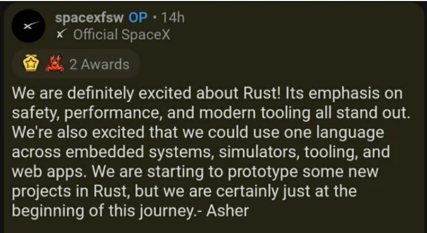

# AeroRust - Your launchpad to aerospace

## What is the AeroRust community?

The AeroRust community is an initiative to propel new contributors into the world of open source and the aerospace industry.
The term aerospace is derived from the words aeronautics and spaceflight. The aerospace industry is engaged in the research, development, and manufacture of flight vehicles, including unpowered gliders and sailplanes , unmanned aerial vehicles (UAVs), lighter-than-air crafts, heavier-than-air crafts (both fixed-wing and rotary-wing), missiles, space launch vehicles, and spacecrafts (manned and unmanned) etc.
The idea is to provide information, materials, tools, crates and etc. to hobbyists and industry leaders, primarily in the Rust language, which is picking up speed, already making a change in other industries and inspiring changes in other languages and communities. More on this in the Rust benefits section coming up.

## Who is it for? Who can participate?

Anyone, with no barrier to entry. All you need is an interest in robotics and programming and ready to apply it in space, aviation or aeronautics and you’re good to go!

## How to join and contribute?

[Discord](https://discord.com/invite/6wFvsFWfnu) says hi, feel free to drop in if you’re even remotely interested in robotics, programming, aerospace etc.
For the serious kind, there exist full - fledged working groups, where you’ll find people who are developing many projects (from programming to educational) under the AeroRust organization. A good starting point to get involved is to check out https://github.com/AeroRust/WorkingGroup/issues, where you can find or share new ideas, current projects and more.
You can also check all the `good first issue` in projects like:
- [aerorust.org](https://github.com/AeroRust/AeroRust.github.io/issues) - The AeroRust website
- The [NMEA 0183 crate](https://github.com/AeroRust/nmea/issues) - a maritime protocol
- [Mav](https://github.com/AeroRust/mav/issues) - set of crates, like `mav-sdk`, for working with the Open-source [MAVLink protocol](http://mavlink.io/en) for drones and UAVs.

## Benefits of using Rust

1. Performance:
* Rust is a go-to language when performance matters more than syntax simplicity and development speed because it works well for processing large amounts data. 
* It can handle CPU-intensive operations like executing algorithms, which is why Rust is more suitable than other languages for systems development.
* Because Rust is compiled directly into machine code, there is no virtual machine or interpreter sitting between your code and computer, providing for fast computations.
2. Memory Safety:
* Rust gives you the choice of storing data on the stack or on the heap and determines at compile time when memory is no longer needed and can be cleaned up. This allows efficient usage of memory as well as more performant memory access. 
* Rust guarantees memory safety and lets you control thread behavior and how resources are allocated among threads.
* Rust strives to have as many zero-cost abstractions as possible— abstractions that are as equally as performant as the equivalent hand-written code, which enables you to build complex systems.
* Garbage Collection - Rust doesn’t have garbage collection like most others, the compiler in Rust enforces checks for invalid memory reference leaks and other hazardous or irregular behavior through a unique system of ownership and a borrow checker, which ensures that references and pointers do not outlive the data they point to.

Rust has been **Stack Overflow’s most loved language** for **6** years in a row -
[2015](stack-overflow-2015), [2016](stack-overflow-2016),
[2017](stack-overflow-2017), [2017](stack-overflow-2017),
[2018](stack-overflow-2018), [2019](stack-overflow-2019),
[2019](stack-overflow-2019), [2020](stack-overflow-2020)
and [2021](stack-overflow-2021).

[stack-overflow-2015]: https://insights.stackoverflow.com/survey/2015#tech-super
[stack-overflow-2016]: https://insights.stackoverflow.com/survey/2016#technology-most-loved-dreaded-and-wanted
[stack-overflow-2017]: https://insights.stackoverflow.com/survey/2017#technology-_-most-loved-dreaded-and-wanted-languages
[stack-overflow-2018]: https://insights.stackoverflow.com/survey/2018#technology-_-most-loved-dreaded-and-wanted-languages
[stack-overflow-2019]: https://insights.stackoverflow.com/survey/2019#most-loved-dreaded-and-wanted
[stack-overflow-2020]: https://insights.stackoverflow.com/survey/2020#technology-most-loved-dreaded-and-wanted-languages-loved
[stack-overflow-2021]: https://insights.stackoverflow.com/survey/2021#most-loved-dreaded-and-wanted-language-love-dread

## Case studies and blog posts

Tilde, an early production user of Rust in their Skylight product, were able to
[reduce their memory usage from 5GiB to 50MiB](https://www.rust-lang.org/static/pdfs/Rust-Tilde-Whitepaper.pdf)
by rewriting certain Java HTTP endpoints in idiomatic Rust.

- [Why Rust for safe systems programming - Microsoft Security Response Center](https://msrc-blog.microsoft.com/2019/07/22/why-rust-for-safe-systems-programming)
- [Can Rust replace Python](https://blog.logrocket.com/rust-vs-python-could-rust-replace-python)
- [What is Rust and why is it so popular](https://stackoverflow.blog/2020/01/20/what-is-rust-and-why-is-it-so-popular)

##### Has Rust been to space?

We know from public disclosures that Rust has been used in space already and we even had [talk on 
one of our meetups](https://www.youtube.com/watch?v=k452kSisfcc) for the CUAVA 1 Cubesat which uses Rust.

What we are really excited about is SpaceX's recent tweet on the promising new language and its potential.
